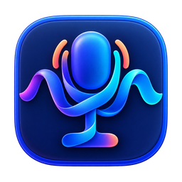

<p align="center">
  
</p>

<h1 align="center">言流 YanFlow</h1>

<p align="center">
  <strong>让声音落在光标上，而不是云端。</strong><br>
  <em>Let your voice land on the cursor—not in the cloud.</em>
</p>

<p align="center">
  <a href="https://github.com/hafung/yanflow/releases/latest">下载免安装包 / Download</a>
  · <a href="#中文">中文</a>
  · <a href="#english">English</a>
</p>


> **Video / 视频** — The moving picture belongs here. Demo coming soon. 影像证词，稍后抵达。

## 中文

言流是 Windows 上的全局实时语音转录工具。默认按住 `Ctrl + Win` 录音，松开识别；`Ctrl + Win + Shift` 切换实时监听。结果会
落进此刻正在编辑的地方；没有合适的输入框时，它就把文字留在一枚可复制、可写入 TXT
的气泡里。

纯本地处理，纯 CPU 完成端点检测和识别。不用担心隐私问题，不需要账号、网络、Python、
PyTorch，更不要求独立显卡。模型由常驻 worker 只加载一次，采集回调只写固定无锁环形
缓冲；没有临时 WAV，没有每句话一次冷启动。识别队列有上限，悬浮窗只在状态变化时重绘。

### 它会什么

- **全局落字**：记事本、浏览器地址栏、VS Code，以及其他标准 Edit/Document 控件。
- **不抢焦点**：原生 Win32 无激活悬浮窗；拖动、隐藏、复制、快捷键设置都在手边。
- **离线端侧**：16 kHz 单声道采集，自适应噪声底、300 ms 预卷、最长 8 秒连续切片。
- **保护切片边界**：长录音优先在静音附近切分；连续语音使用小幅重叠和 CTC 时间对齐，单次推理仍不超过 8 秒。
- **短词也提交**：按住模式单独支持短词，经过较严格的人声复核；静音和短促敲击仍被过滤。
- **安静时停下**：30 秒没有确认的人声后关闭麦克风；边界上的一句话最多再等 8 秒完成识别。
- **减少误触发**：每段录音经过 FSMN-VAD 复核；静音和短促敲击不会直接送入转录。高通滤波减轻低频风噪。
- **失焦也不失语**：目标不可写时，转录进入向左展开的气泡，可一键复制或写入桌面。
- **开箱即用**：下载 Release ZIP，解压，双击 `yanflow.exe`。没有安装器，也没有“下一步”。

### 三步，声音就有了去处

1. 从 [Releases](https://github.com/hafung/yanflow/releases/latest) 下载 `windows-x64.zip`。
2. 解压到任意可写目录，运行 `yanflow.exe`。
3. 按住 `Ctrl + Win` 录音，松开任一键识别（最长 60 秒）。`Ctrl + Win + Shift` 按一次
   开启实时监听，再按一次关闭。右键悬浮按钮可以设置额外快捷键或关闭按住模式。

### 保守纠错

词典先做明确的大小写规范和术语映射；音近词必须列出误识别形式和同句上下文，默认不做
模糊猜测。右键选择“编辑自定义词典”，保存后下一次识别生效。MacBERT4CSC 是默认关闭的
本地 C++ worker，模型随标准包附带，只接受高置信度中文单字替换，并保护词典术语、英文、数字和可识别的代码片段。
资源缺失、超时或异常时保留第一阶段结果。安装包无需 Python 或额外运行时安装；菜单可查看加载失败的具体原因。

右键“保存最近识别对照”可导出本次运行最近 20 条原始 ASR、纠错结果及输出核验状态，人工校对后评测 CER 和误改。
右键“纠正并记住”可确认误词→正确词，默认只用于这次录音的目标应用，并复制本次正确文本。
记住的是用户确认的替换规则，不训练模型，也不自动推断新的误词。
“应用词库”可选择自动、通用或开发词库；应用专用词库叠加在所选词库上，升级不会覆盖个人规则。
气泡按文字长短调整尺寸，长文本自动换行并有尺寸上限；复制后按钮变为“关闭”，点击可收起气泡。
启用可选模型、词典格式及三阶段评测方法见 [纠错说明](docs/text-correction.md)。

Windows 可能在首次使用麦克风时请求权限。普通权限进程不能向管理员权限窗口注入文本，
这是 Windows UIPI 的边界，不是言流在故作矜持。

GitHub ZIP 当前未使用受信任的代码签名，首次启动可能出现 SmartScreen“无法识别的应用”
提示。请先确认来自本项目 Release，并核对 ZIP 的 SHA-256；确认信任该下载后，可以在
提示中选择“更多信息 → 仍要运行”（组织策略可能不允许）。无需关闭 Defender 或 SmartScreen。
发行者需要受信任的代码签名并积累下载信誉，或通过 Microsoft Store 分发来改善此提示；
修改图标、版本信息或使用自签名证书都不能保证消除警告，EV 证书也不再保证首次免提示。
参见 [微软的 SmartScreen 说明](https://learn.microsoft.com/en-us/windows/apps/package-and-deploy/smartscreen-reputation)。

## English

Some words should not have to leave the room before they become text.

YanFlow is a system-wide voice layer for Windows. It floats above every app without stealing
focus. Hold `Ctrl + Win` to record and release to recognize; the transcript lands in whatever you are editing.
If there is no writable target, the words wait in a compact bubble—ready to copy or save as TXT.

Its “cloud” is the few centimetres of air above your desk. SenseVoiceSmall Q8 and FSMN-VAD run
entirely on the local CPU: no audio upload, account, network service, Python, PyTorch, or discrete
GPU. A resident worker loads the model once; audio capture writes into a fixed lock-free ring
buffer. No temporary WAV files. No cold start for every sentence. The footprint does not vanish
by incantation—it is simply kept inside deliberate boundaries.

### What it does

- **Types system-wide** into Notepad, browser address bars, VS Code, and other Edit/Document controls.
- **Keeps your focus** with a native non-activating Win32 overlay and configurable global hotkeys.
- **Stays on-device** with 16 kHz mono capture, adaptive noise floor, 300 ms pre-roll, and 8 s slices.
- **Stops an idle microphone** after 30 s without confirmed speech, with one brief grace period for a phrase in progress.
- **Checks speech with FSMN-VAD** before transcription and attenuates low-frequency ventilation rumble.
- **Catches stray words** in a left-expanding bubble when the target cannot accept text.
- **Ships ready** as a portable ZIP: extract and run `yanflow.exe`; there is nothing to install.

### Three steps from air to cursor

1. Download the `windows-x64.zip` from [Releases](https://github.com/hafung/yanflow/releases/latest).
2. Extract it to any writable directory and run `yanflow.exe`.
3. Hold `Ctrl + Win` to record; release either key to recognize (60 s maximum).
   Press `Ctrl + Win + Shift` to toggle hands-free listening on or off.
   Right-click the orb to configure additional keys or disable hold mode.

An editable dictionary normalizes explicit terms conservatively. Optional MacBERT4CSC is disabled
by default, included in every standard package, and only accepts tightly gated Chinese character edits; dictionary terms, English,
numbers, and recognizable code are protected. Export up to 20 recent raw/final pairs with delivery verification from the orb menu to
measure improvements against a human transcript. See [correction details](docs/text-correction.md).

Windows may request microphone permission on first use. A normal process cannot inject text into an
elevated process because of UIPI; that boundary is intentional.

## Build / 构建

YanFlow is a native Windows x64 application written in C++17, using Win32 for the GUI,
audio capture, hotkeys, and text injection. Both the GUI and recognition worker statically link
the MSVC runtime; PHP, TypePHP, and a separate VC redistributable are not required.
On Windows, install Visual Studio 2022 Build Tools with the Desktop development with C++ workload,
including the Windows SDK and C++ CMake tools (CMake and Ninja):

```powershell
build\windows\build-yanflow.cmd
```

The script downloads pinned SenseVoice/FSMN resources, verifies SHA-256 values, builds the
persistent C++ worker and native GUI with CMake, embeds the icons as Windows resources,
then stages a fresh `build\artifacts\yanflow-windows-x64\` and runs window and ASR smoke tests.
`VS_BUILD_TOOLS` remains overridable. The previous TypePHP implementation is preserved on
the `history/typephp-2026-10-08` branch.

Pushes and pull requests build that same portable package on GitHub Actions. A `v*` tag also creates
a GitHub Release with the ZIP and `SHA256SUMS` automatically.

Useful focused checks / 常用专项验证：

```powershell
build\windows\test-yanflow-worker.cmd
build\windows\test-yanflow-native.cmd
build\windows\test-yanflow-idle.cmd
build\windows\test-yanflow-pipeline.cmd
build\windows\test-yanflow-textbox.cmd
build\windows\test-yanflow-fallback.cmd
build\windows\test-yanflow-ui.cmd
build\windows\test-yanflow-edge.cmd
build\windows\test-yanflow-vscode.cmd
build\windows\test-yanflow-hold.cmd
build\windows\test-yanflow-correction.cmd
build\windows\test-yanflow-accuracy.cmd
```

The native-package check verifies PE imports, creates `build\artifacts\YanFlow-native-windows-x64.zip`
and its `SHA256SUMS-native.txt`, then extracts and runs the application from a path containing
spaces and Unicode. It also checks the missing-wave and missing-worker exit codes.
Every standard build includes CSC. The check verifies its app-local DLL dependencies and exercises
the actual model through the main application from the extracted path. Run
`build\windows\build-yanflow.cmd`; ONNX Runtime and the model are pinned and SHA-256 checked.

## Boundaries / 边界

Today YanFlow targets Windows x64 and CPU inference. Automated evidence covers persistent-worker
repetition, the full segmentation pipeline, standard text boxes, Edge, VS Code, and the fallback
bubble. A combined live-human microphone session and a 24–72 hour soak remain future evidence—not
retroactive folklore.
Hold-mode automated evidence uses injected PCM and a key-state smoke. Physical modifier chords,
Start-menu masking, session lock/resume, and a live human hold-to-record session require manual
Windows validation. Synthetic correction fixtures establish guard behavior, not a lower live-ASR
error rate; that requires paired real speech and human transcripts.
Accuracy smoke covers quiet and forced boundaries in repeated 19.2 s PCM fixtures, a 300 ms speech
fragment through capture/flush/VAD/ASR, short silence/tap rejection, and the native correction dialog
with dictionary persistence and application isolation. CTC times are approximate; isolated syllables
can still be misrecognized. These fixtures do not establish live microphone accuracy or overall CER gains.

Single-microphone filtering and VAD can reduce steady fan noise, silence, and brief impacts. They
cannot reliably isolate a nearby speaker from background voices or cancel room echo without a
playback reference. CPU load and heat also depend on microphone input and the host machine; the
automated worker smoke checks short-run working-set drift, not long-term thermal behavior.

YanFlow is GPL-3.0-only. Models and bundled runtimes retain their own licenses; see
[third-party notices](THIRD-PARTY-NOTICES.md) and the license files included in every release ZIP.
